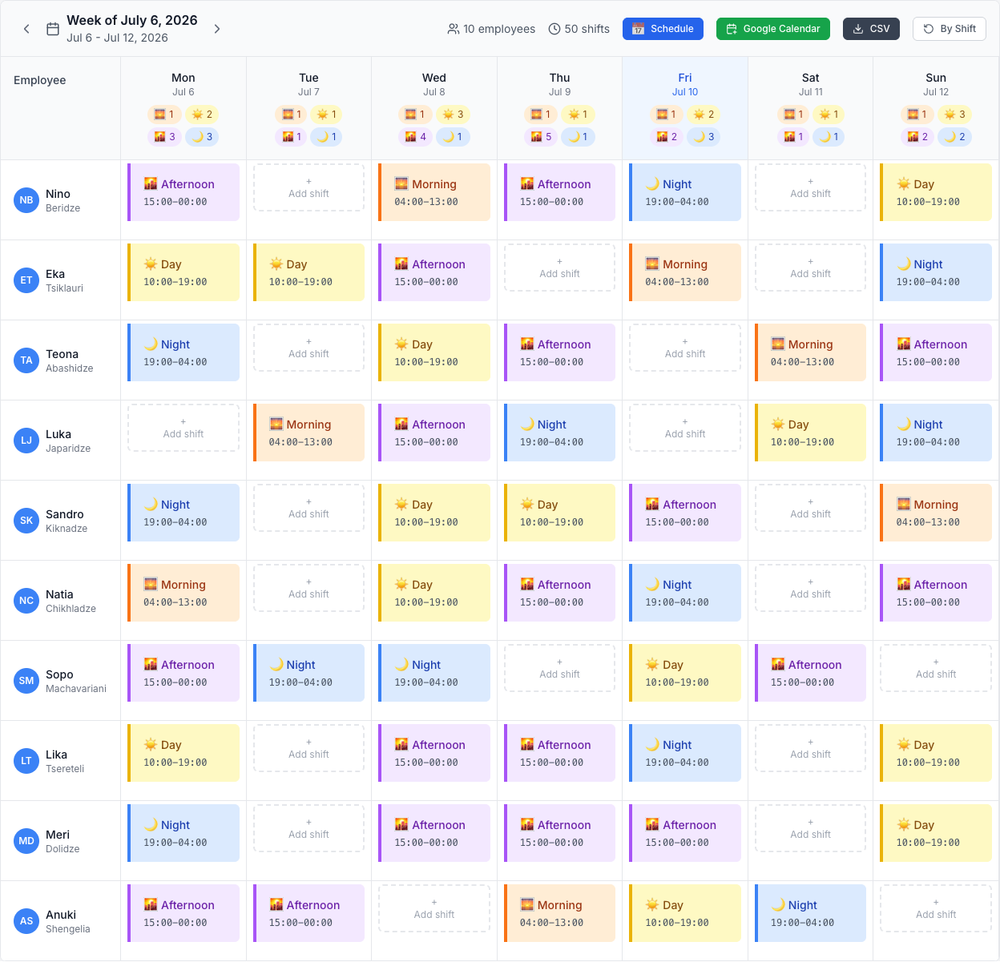

# CS Shift Scheduler

Auto-generates 24/7 shift rosters for a customer support team using constraint optimization (Google OR-Tools CP-SAT). Replaced a paid scheduling service (~$1,000/yr) and is used by about 25 people daily. The internal deployment is company-hosted; this copy can be self-hosted per the setup section below.

> **Public-safe copy.** This is a sanitized copy of an internal production tool. Employee names are fictional, credentials are placeholders, and real data is replaced with demo fixtures. The original runs in production daily.

**[Live demo → io-scheduler-demo.web.app](https://io-scheduler-demo.web.app)** — no login needed, demo mode with a fictional team. "Generate Shift" in the demo cycles through pre-computed results from the real OR-Tools solver (the solver backend itself is not deployed for the demo).



*The grid above is genuine solver output: 10 fictional employees, 50 shifts, generated by the OR-Tools model in this repo and rendered by the real UI in demo mode (`cd scheduler-ui && VITE_DEMO_MODE=true npm run dev` — no Firebase or backend needed).*

## Features

- Constraint-based schedule generation: rest rules, coverage minimums, leaves, and pre-assigned shifts are all hard constraints, not suggestions
- Shift-swap requests with admin approval and email notifications (EmailJS)
- Leave imports and per-employee day-offs blocked before generation
- Overtime tracking and labor reports
- Bulk generation of multiple weeks; per-week visibility control while finalizing
- Slack notifications, Google Calendar export, Google Sheets integration
- Google OAuth restricted to the company domain

## Scheduling constraints

- 12-hour minimum rest between consecutive shifts, including across week boundaries
- 5 shifts per employee per week, minus all-day leaves
- Max 1 shift per employee per day
- Per-shift coverage requirements (min ≤ assigned ≤ max)
- Pre-assigned shifts survive regeneration

| Shift | Hours | Min | Max |
|-------|-------|-----|-----|
| Morning | 04:00–13:00 | 1 | 1 |
| Day | 10:00–19:00 | 2 | 4 |
| Afternoon | 15:00–00:00 | 2 | 4 |
| Night | 19:00–04:00 | 2 | 5 |

## How it works

`scheduler.py` builds a CP-SAT model from the week's inputs (employees, leaves, pre-assignments, prior week's last shifts for cross-week rest) and solves for a feasible roster. A FastAPI service (`functions/api_fastapi.py`) wraps it and runs on Cloud Run. The React frontend reads and writes schedule data in Firebase Realtime Database, so edits and swap approvals show up live for everyone. Cloud Build handles CI/CD from `cloudbuild.yaml`.

## Stack

| Layer | Technology |
|-------|-----------|
| Frontend | React 18, Vite, Tailwind CSS, Framer Motion |
| Backend | Python 3.12, FastAPI, Google OR-Tools CP-SAT |
| Data | Firebase Realtime Database |
| Auth | Firebase Authentication (Google OAuth) |
| Hosting | Firebase Hosting (frontend), Cloud Run (API) |
| CI/CD | Google Cloud Build |

## Setup

Bring your own Firebase project and Google Cloud project. Placeholders like `YOUR_FIREBASE_API_KEY` in the service files are meant to be replaced with your own values.

### Backend

```bash
pip install -r requirements.txt
cd functions
uvicorn api_fastapi:app --reload --port 8000
```

### Frontend

Create `scheduler-ui/.env` with your Firebase config (`VITE_FIREBASE_API_KEY`, `VITE_FIREBASE_AUTH_DOMAIN`, `VITE_FIREBASE_PROJECT_ID`, `VITE_FIREBASE_DATABASE_URL`, ...), then:

```bash
cd scheduler-ui
npm install
npm run dev          # localhost:3000
```

### CLI

```bash
python scripts/generate.py --week-start 2026-05-18   # generate from the command line
python scripts/diagnose_infeasibility.py             # explain why a spec has no solution
```

### Deploy

```bash
cd scheduler-ui && npm run build && cd ..
firebase deploy --only hosting                        # frontend
gcloud builds submit --region=YOUR_REGION --project=YOUR_PROJECT_ID   # backend via cloudbuild.yaml
```

## Tests

9-module pytest suite covering the solver: rest rules, pre-assignments, consecutive nights, high-traffic days, labor reports, and regression cases.

```bash
python -m pytest tests/
python -m pytest tests/ --cov=scheduler --cov-report=html
```

## Project structure

```
scheduler.py                # CP-SAT solver (single source of truth)
functions/api_fastapi.py    # FastAPI endpoints
scheduler-ui/               # React frontend (Vite)
tests/                      # pytest suite
scripts/                    # generate.py, diagnose_infeasibility.py
tools/                      # week summary reports
Dockerfile, cloudbuild.yaml # Cloud Run build + deploy
```

## About

Built by a customer support manager with AI-assisted development, no engineering team involved. It has run in production since launch.
